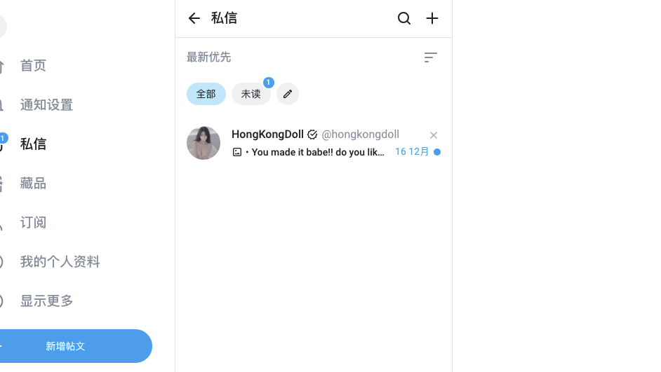
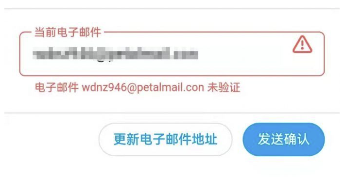
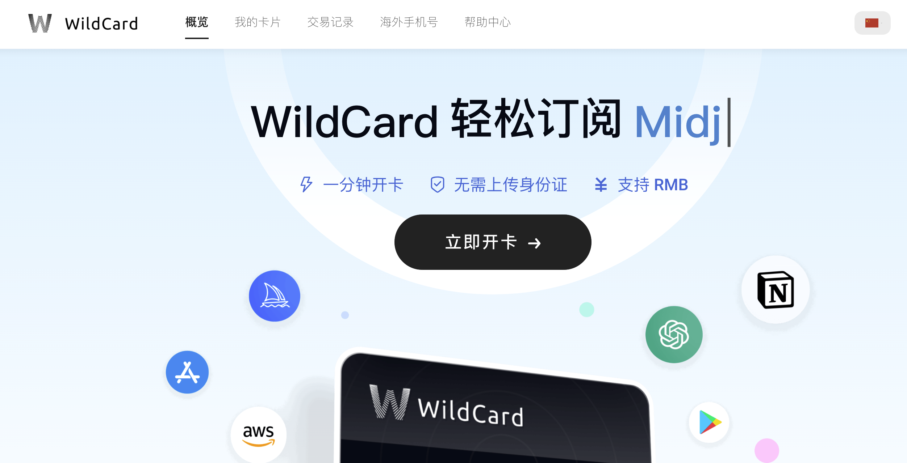
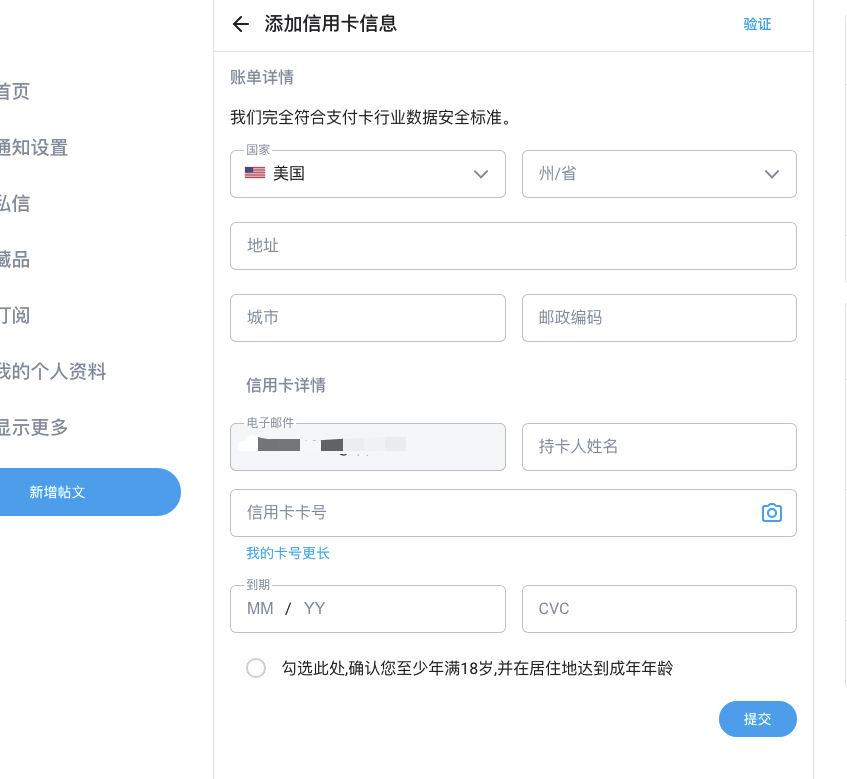
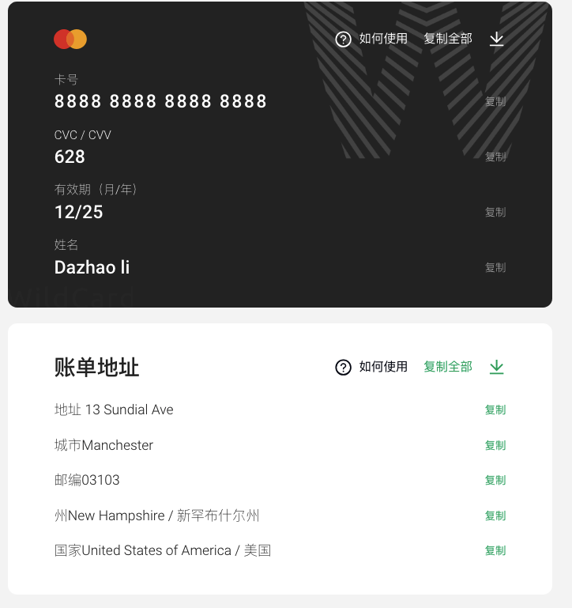
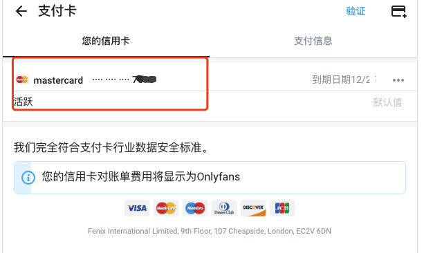

# onlyfans 如何使用虚拟卡进入充值，一文教你订阅订阅博主（最新图文教程）
## onlyfans怎么国内支付？
onlyfans不支持国内银行开的普通卡，需要使用特定的虚拟卡进行订阅。

下面我们来看下社交平台onlyfans虚拟信用卡订阅教程。 

（PS：本文教程完全目前可用(24年)，可以放心使用~

## 一、注册
### 1.1 注册链接：
https://onlyfans.com/
使用国内邮箱、qq、163 等邮箱即可注册

### 1.2 邮箱验证
然后进行邮箱验证，我们这里点击发送会收到一封onlyfans的验证邮件，将收到的链接在登录的浏览器里复制粘贴打开即可验证成功。

邮箱验证onlyfans

## 二、支付
### 2.1 不建议大家去某宝店铺买
淘宝店铺的开卡费很贵，并且是一次性使用！！！

我已经踩过坑了，买了 30 usd，实际汇率只需要 220 元左右，但是收了 280，最最关键的是这个卡只能用一次，是临时的！

### 2.2 推荐长期稳定的虚拟卡平台：
比如：

https://bewildcard.com/i/GPT9 ( 使用这个链接复制到浏览器打开，2分钟即可搞定开卡，还可享受88折优惠~)

用这个链接还可以享受开卡88折优惠，开卡费总共100元左右，开的卡有效期达2年，后续每次消费只需要充值你需要的美元金额即可，直接银行卡就能支付入账，超级方便，冲多了还可以提现回来。

## 三 开好卡后，如何使用
首先往卡里充值订阅博主付费内容需要的金额即可（建议多充1-2美元，防止扣款失败）

然后去onlyfans绑定虚拟卡，https://onlyfans.com/my/payments/add_card：

上面需要的每一项信息，都可以直接在虚拟卡网页上看到，直接复制过去即可：

onlyfans绑定卡方式

绑定支付信用卡后，就可以去订阅喜欢的博主啦，比如 hongkongdoll 之类的，是不是很快捷：

## 四、END
